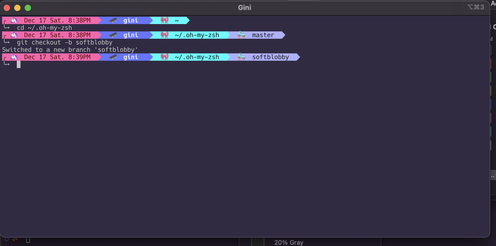

# zsh-themes

## Softblobby

A ZSH theme for people who love unicorns, pink, and purple.




## How to install

1. Copy the `softblobby.zsh-theme` file into your ZSH themes folder (default is `~/.oh-my-zsh/themes`).
2. Go to your terminal and under `Preferences > Profiles` and in the section `Basic Colors` set the `Background` color to `#332943`.
3. In your terminal, edit your `~/.zshrc` file so that the `ZSH_THEME` points to `softblobby`:

```
ZSH_THEME = "softblobby"
```

4. Run `source ~/.zshrc` after saving the file with the new theme and restart your terminal.